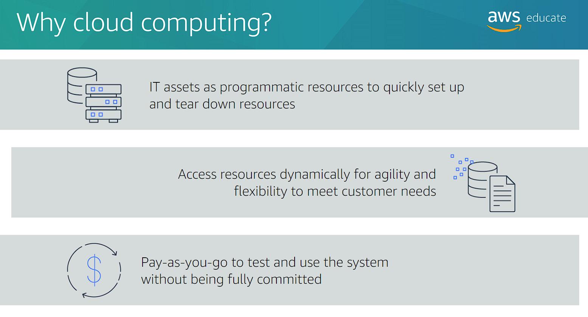
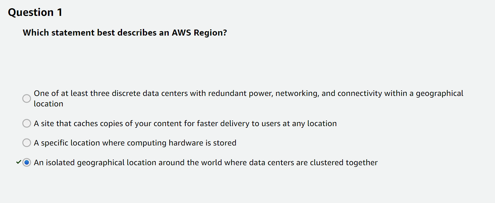

# Getting started with AWS
-)#H(kx5F5#hy6N
- [Getting started with AWS](#getting-started-with-aws)
  - [Intro To Cloud](#intro-to-cloud)
    - [Intro To Cloud Computing](#intro-to-cloud-computing)
  - [AWS Cloud Overview - Regions \& AZ](#aws-cloud-overview---regions--az)
    - [AWS History](#aws-history)
    - [AWS Cloud Number Facts](#aws-cloud-number-facts)
    - [AWS Cloud Use Cases](#aws-cloud-use-cases)
    - [Global Infrastructure](#global-infrastructure)
    - [AWS Regions](#aws-regions)
    - [How to choose an AWS Region?](#how-to-choose-an-aws-region)
    - [AWS Availability Zones](#aws-availability-zones)
    - [Knowledge check](#knowledge-check)
    - [AWS Points of Presence (Edge Locations)](#aws-points-of-presence-edge-locations)
  - [Tour of the AWS Console \& Services in AWS](#tour-of-the-aws-console--services-in-aws)
    - [Region Selector](#region-selector)
    - [Recently used section](#recently-used-section)
    - [Welcome section and Health](#welcome-section-and-health)
    - [Services Section](#services-section)
  - [003 About the UI changes in the course](#003-about-the-ui-changes-in-the-course)
    - [Let's open a service](#lets-open-a-service)

## Intro To Cloud

### Intro To Cloud Computing

## AWS Cloud Overview - Regions & AZ

### AWS History

### AWS Cloud Number Facts

### AWS Cloud Use Cases

### Global Infrastructure

### AWS Regions

### How to choose an AWS Region?

### AWS Availability Zones

### Knowledge check

### AWS Points of Presence (Edge Locations)

## Tour of the AWS Console & Services in AWS

### Region Selector

choose a location that is geographically close to you.
or the region makes most sense to your application.

### Recently used section

### Welcome section and Health

### Services Section

we can chose by category or alphabetical order.

## 003 About the UI changes in the course

### Let's open a service

let's open route 53.
here u can see u don't have to select a region.
because it is global service.
