# IAM & AWS CLI

## 001 IAM Introduction Users, Groups, Policies

### IAM: Users & Groups

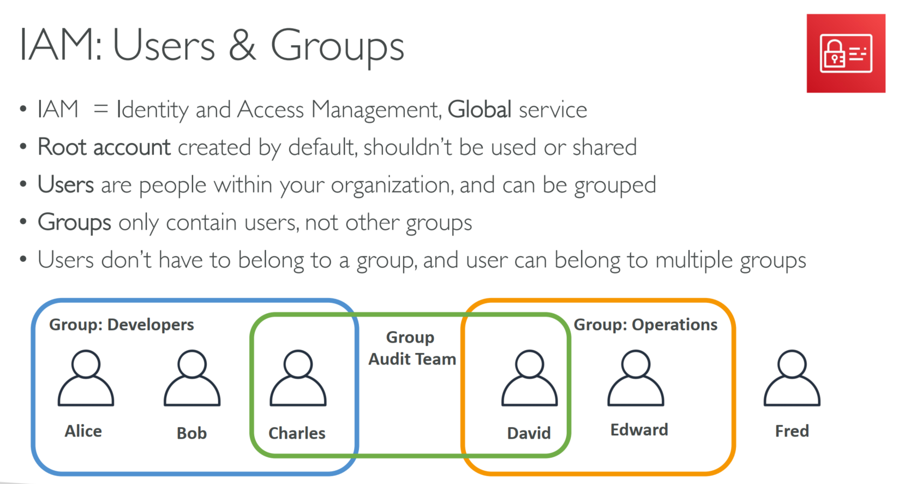

### IAM: Permissions

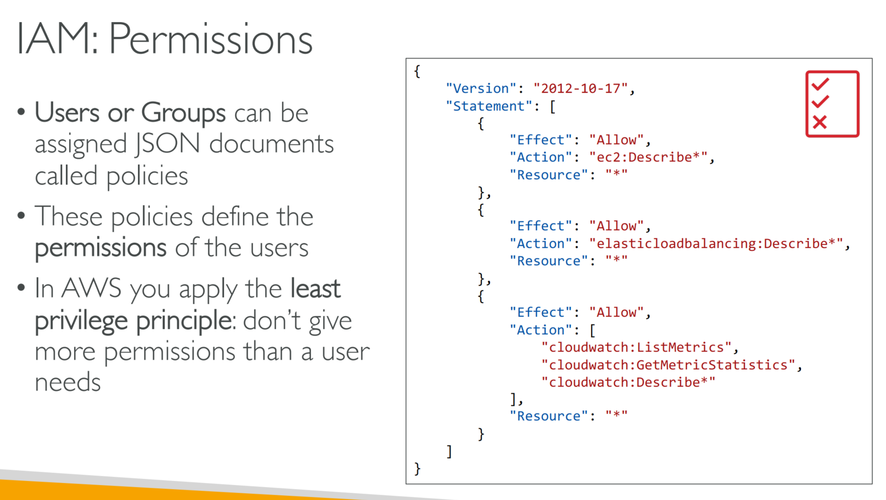

## 002 IAM Users & Groups Hands On

IAM doesn't need a region section.
Root user has all the permissions in the AWS.
so it is very dangerous to use the root account.
therefore we will create a admin account.

- [let's create a aws user account demo Video](https://youtu.be/zGy8gXw1vGg)

- [I AM users and Groups hands on Video](https://youtu.be/UsaELQ6SPb0)

## 003 IAM Policies

### IAM Policies inheritance

### IAM Policies Structure

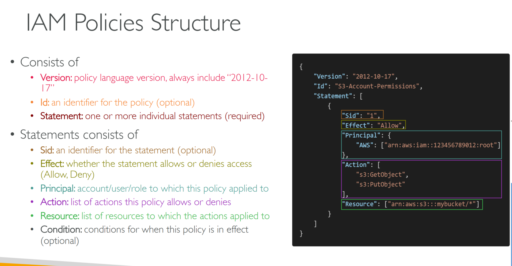

## 004 IAM Policies Hands On

-[will create a video to explain the demo]()

### IAM – Password Policy

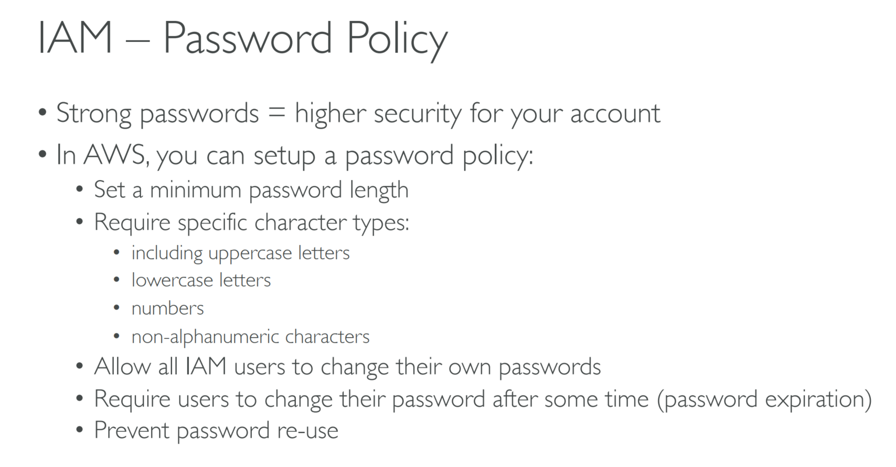

### Multi Factor Authentication - MFA

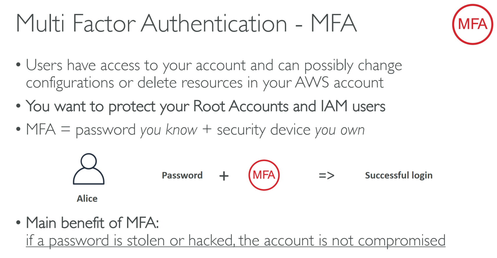

### MFA devices options in AWS

### How can users access AWS ?

### Example (Fake) Access Keys

## 006 IAM MFA Hands On

[create a demo video for this]()

## 007 AWS Access Keys, CLI and SDK

### What’s the AWS CLI?

### What’s the AWS SDK?

### IAM Roles for Services

## 005 IAM MFA Overview

### IAM Security Tools

### IAM Guidelines & Best Practices

### Shared Responsibility Model for IAM

### IAM Section – Summary

## 008 AWS CLI Setup on Windows

[make a video for this]()

## 009 AWS CLI Setup on Mac OS X

## 010 AWS CLI Setup on Linux

## 011 AWS CLI Hands On

generate the access keys for the user
from the IAM user

use it on the console
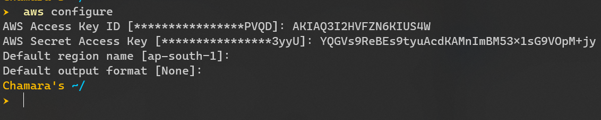

[aws cli commands](https://whimsical.com/aws-cli-AeMCssSbxJiWcjzggETqq1@2Ux7TurymN7CSZ7QwNKD)

## 013 AWS CloudShell

## 014 IAM Roles for AWS Services

## 015 IAM Roles Hands On

## 016 IAM Security Tools

## 017 IAM Security Tools Hands On

## 018 IAM Best Practices

## 019 IAM Summary

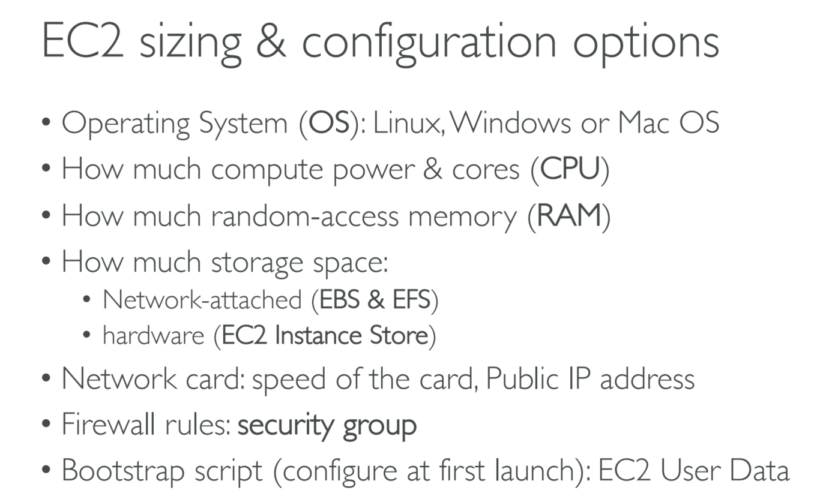

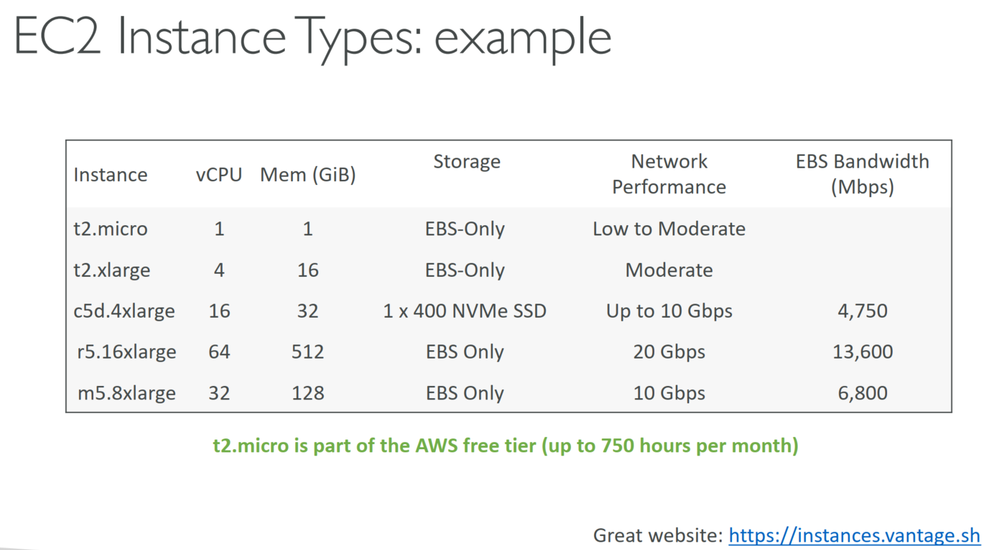
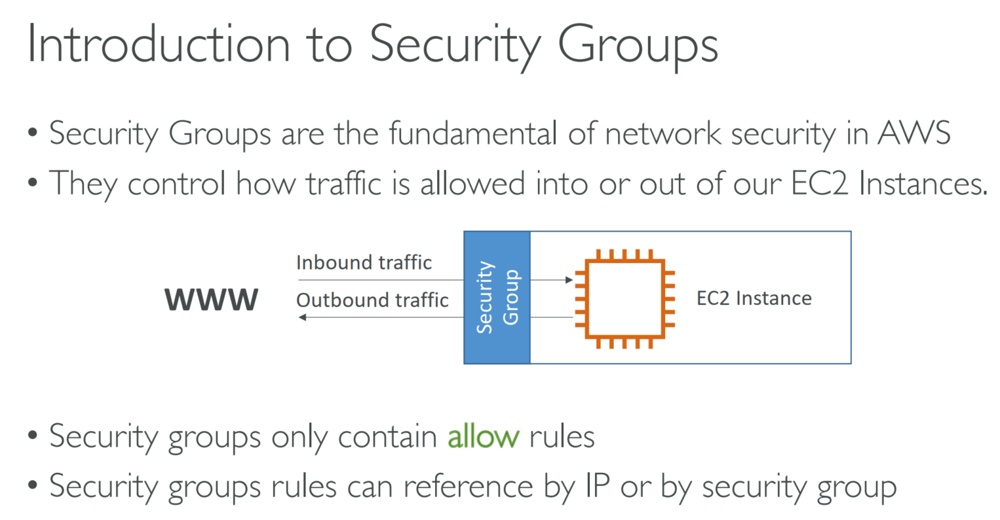
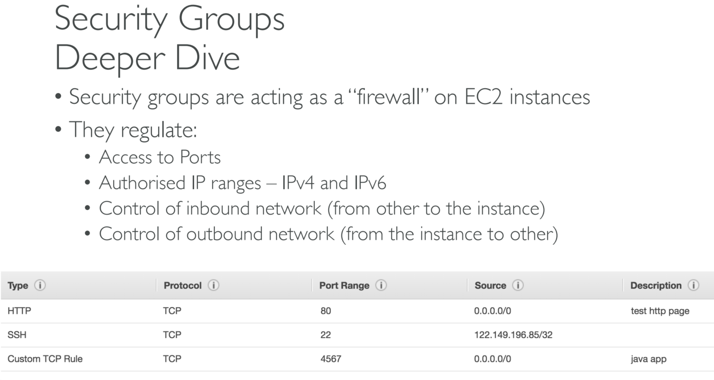

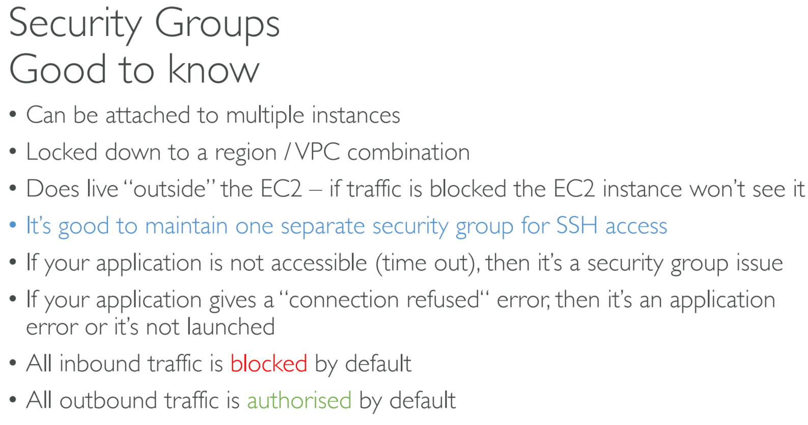

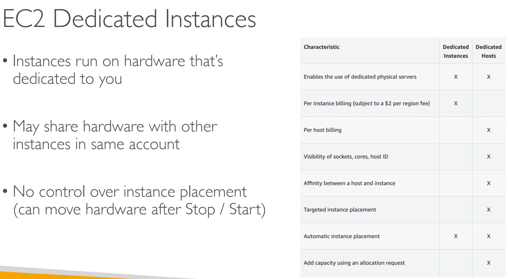
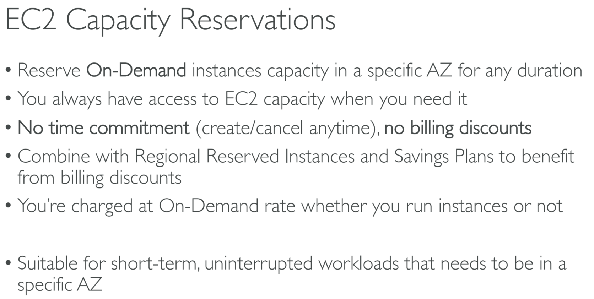

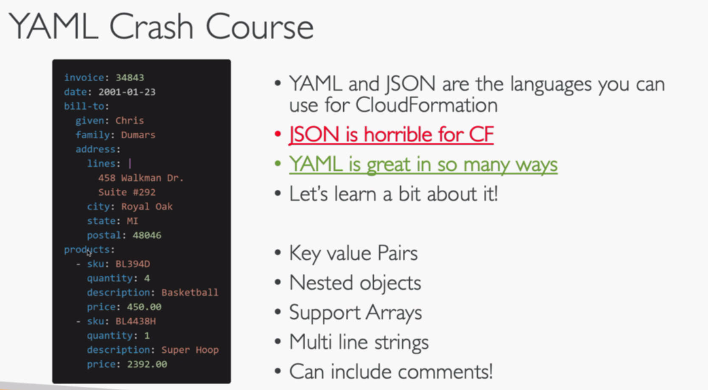

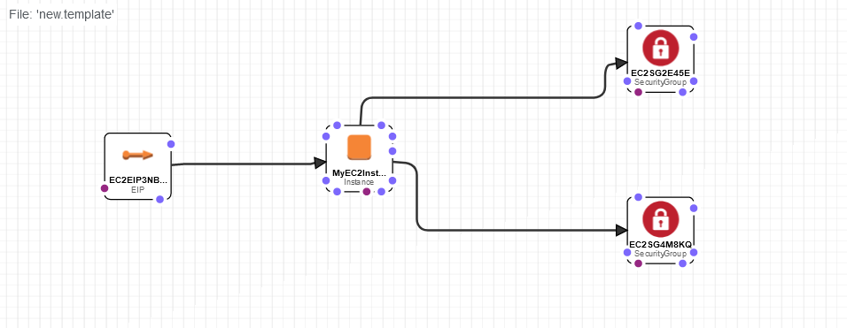

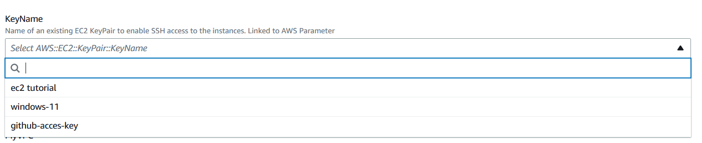

