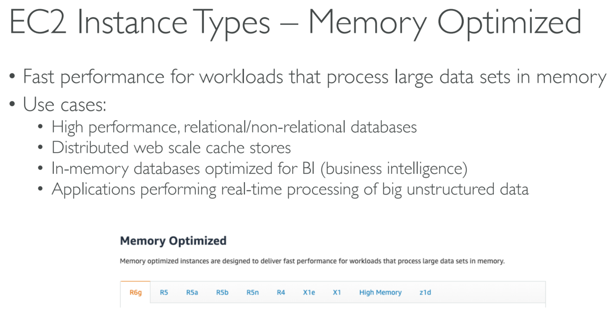
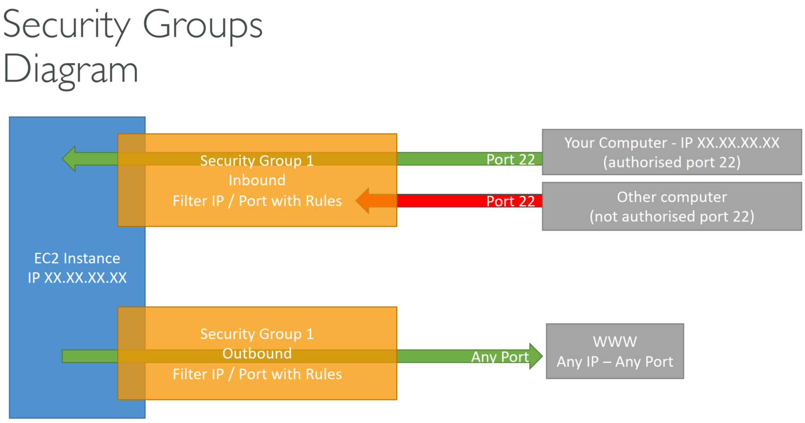
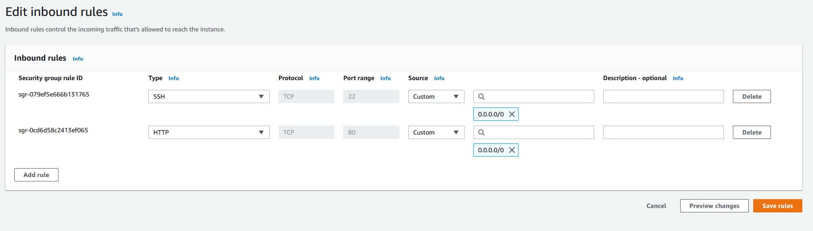
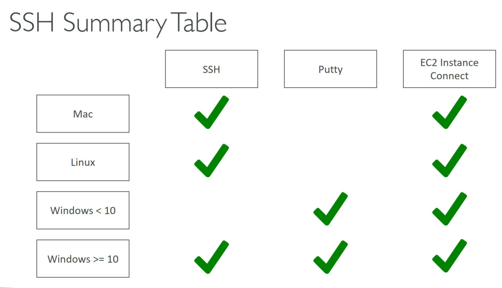
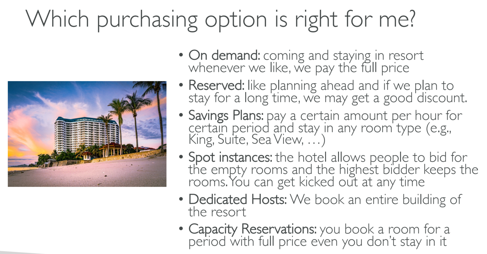

# EC2 Fundamentals

- [EC2 Fundamentals](#ec2-fundamentals)
  - [001 AWS Budget Setup](#001-aws-budget-setup)
    - [Amazon EC2](#amazon-ec2)
    - [EC2 sizing & configuration options](#ec2-sizing--configuration-options)
    - [EC2 User Data](#ec2-user-data)
  - [002 EC2 Basics](#002-ec2-basics)
    - [Hands-On:Launching an EC2 Instance running Linux](#hands-onlaunching-an-ec2-instance-running-linux)
  - [003 Create an EC2 Instance with EC2 User Data to have a Website Hands On](#003-create-an-ec2-instance-with-ec2-user-data-to-have-a-website-hands-on)
    - [create a demo video for this](#create-a-demo-video-for-this)
  - [004 EC2 Instance Types Basics](#004-ec2-instance-types-basics)
    - [Amazon EC2 Instance Types](#amazon-ec2-instance-types)
    - [EC2 Instance Types - General Purpose](#ec2-instance-types---general-purpose)
    - [EC2 Instance Types - Compute Optimized](#ec2-instance-types---compute-optimized)
    - [EC2 Instance Types - Memory Optimized](#ec2-instance-types---memory-optimized)
    - [EC2 Instance Types - Storage Optimized](#ec2-instance-types---storage-optimized)
    - [EC2 Instance Types - Example](#ec2-instance-types---example)
  - [005 Security Groups & Classic Ports Overview](#005-security-groups--classic-ports-overview)
    - [introduction to security groups](#introduction-to-security-groups)
    - [Security Group Deep Dive](#security-group-deep-dive)
    - [Security Group Diagram](#security-group-diagram)
    - [Security Groups Good to Know](#security-groups-good-to-know)
    - [Referencing other security groups](#referencing-other-security-groups)
    - [Classic ports to know](#classic-ports-to-know)
  - [006 Security Groups Hands On](#006-security-groups-hands-on)
  - [007 SSH Overview](#007-ssh-overview)
    - [SSH Summery Table](#ssh-summery-table)
    - [Which lectures to watch](#which-lectures-to-watch)
    - [SSH TroubleShooting](#ssh-troubleshooting)
  - [008 How to SSH using Linux or Mac](#008-how-to-ssh-using-linux-or-mac)
  - [009 How to SSH using Windows](#009-how-to-ssh-using-windows)
  - [010 How to SSH using Windows 10](#010-how-to-ssh-using-windows-10)
  - [012 EC2 Instance Connect](#012-ec2-instance-connect)
  - [013 EC2 Instance Roles Demo](#013-ec2-instance-roles-demo)
  - [014 EC2 Instance Purchasing Options](#014-ec2-instance-purchasing-options)
    - [EC2 instance Purchasing options](#ec2-instance-purchasing-options)
    - [EC2 on Demand](#ec2-on-demand)
    - [EC2 Reserved Instance](#ec2-reserved-instance)
    - [EC2 Savings Plan](#ec2-savings-plan)
    - [Spot Instance](#spot-instance)
    - [EC2 Dedicated Hosts](#ec2-dedicated-hosts)
    - [EC2 Dedicated Instance](#ec2-dedicated-instance)
    - [EC2 Capacity Reservations](#ec2-capacity-reservations)
    - [Which Purchasing options are right for you](#which-purchasing-options-are-right-for-you)
    - [Price comparison](#price-comparison)

## 001 AWS Budget Setup
first enable aws billing access to non root account
this will allow iam users who are admins to access the billing data.


how to read aws bill
here we can see the details of all the services which are incurring cost


here we can access the aws free tire usage

let's create a budget

here is the created budget

[TODO demo video]()


### Amazon EC2


### EC2 sizing & configuration options


### EC2 User Data


## 002 EC2 Basics

### Hands-On:Launching an EC2 Instance running Linux


## 003 Create an EC2 Instance with EC2 User Data to have a Website Hands On


this user data will run only once when we create the instance


now we can see the instance is running


public ip is for internet t0 connect to the ec2 instance

private ip is for internal access to the ec2 in aws network


so to test out website we can call the
this is our public ip address
```
http://13.126.24.0
```


this will only work for http because of our security group inbound rule


to stop a ec2 instance
then we don't have to pay


if we want to get rid of our ec2 instance


to start a stopped instance we can use


here we can see the public ip address has changed

previous ip address 13.126.24.0
current  ip address 13.234.32.140

but the private ip will not change


### [create a demo video for this]()

## 004 EC2 Instance Types Basics
[EC2 Documentation link](https://aws.amazon.com/ec2/instance-types/)

### Amazon EC2 Instance Types


[details link](https://aws.amazon.com/ec2/instance-types/)

### EC2 Instance Types - General Purpose


### EC2 Instance Types - Compute Optimized


### EC2 Instance Types - Memory Optimized



### EC2 Instance Types - Storage Optimized


### EC2 Instance Types - Example


[ec2 comparison details](https://instances.vantage.sh/?region=ap-south-1)

## 005 Security Groups & Classic Ports Overview


### introduction to security groups


### Security Group Deep Dive


### Security Group Diagram



### Security Groups Good to Know


### Referencing other security groups


### Classic ports to know


## 006 Security Groups Hands On

let's analyze the security group we created for the ec2 instance.


this is the security group view


let's look at the inbound rules

request which are coming to the ec2 instance



ssh from anywhere though port 22
http from anywhere though port 80

are allowed to the ec2 instance

any time u see a time out this is a security group issue.

[TODO make a demo video]()

## 007 SSH Overview
---------------------- 

### SSH Summery Table



### Which lectures to watch


### SSH TroubleShooting

;

<h4><strong>SSH&nbsp;Troubleshooting</strong></h4><p><br></p><blockquote><p><strong>1) There's a connection timeout</strong></p></blockquote><p>This is a security group issue. Any timeout (not just for SSH) is related to security groups or a firewall. Ensure your security group looks like this and correctly assigned to your EC2 instance. </p><figure></figure><blockquote><p><strong>2)&nbsp;There's still a connection timeout issue</strong></p></blockquote><p>If your security group is properly configured as above, and you still have connection timeout issues, then that means a corporate firewall or a personal firewall is blocking the connection. <strong>Please use EC2 Instance Connect as described in the next lecture.</strong></p><p><br></p><blockquote><p><strong>3) SSH&nbsp;does not work on Windows</strong></p></blockquote><ul><li><p>If it says: <code>ssh command not found</code>, that means you have to use Putty</p></li><li><p>Follow again the video. If things don't work, please use EC2 Instance Connect as described in the next lecture</p></li></ul><p><br></p><blockquote><p><strong>4)&nbsp;There's a connection refused</strong></p></blockquote><p>This means the instance is reachable, but no SSH&nbsp;utility is running on the instance</p><ul><li><p>Try to restart the instance</p></li><li><p>If it doesn't work, terminate the instance and create a new one. Make sure you're using <strong>Amazon Linux 2</strong></p></li></ul><p><br></p><blockquote><p><strong>5)&nbsp; </strong><code><strong>Permission denied (publickey,gssapi-keyex,gssapi-with-mic)</strong></code></p></blockquote><p>This means either two things:</p><ul><li><p>You are using the wrong security key or not using a security key. Please look at your EC2 instance configuration to make sure you have assigned the correct key to it. </p></li><li><p>You are using the wrong user. Make sure you have started an <strong>Amazon Linux 2 EC2 instance</strong>, and make sure you're using the user <strong>ec2-user. </strong>This is something you specify when doing <code><strong>ec2-user@</strong>&lt;public-ip&gt;</code> (ex:&nbsp;<code>ec2-user@35.180.242.162</code>) in your SSH&nbsp;command or your Putty configuration</p></li></ul><p><br></p><blockquote><p><strong>6) Nothing is working - "aaaahhhhhh"</strong></p></blockquote><p>Don't panic. Use <strong>EC2 Instance Connect</strong> from the next lecture. Make sure you started an <strong>Amazon Linux 2</strong> and you will be able to follow along with the tutorial :)</p><p><br></p><blockquote><p><strong>7)&nbsp;I was able to connect yesterday, but today I can't</strong></p></blockquote><p>This is probably because you have stopped your EC2 instance and then started it again today. <strong>When you do so, the public IP&nbsp;of your EC2 instance will change.</strong> Therefore, in your command, or Putty configuration, please make sure to edit and save the new public IP.</p><p><br></p><p><strong>Happy troubleshooting!</strong><br>Stephane</p>

## 008 How to SSH using Linux or Mac


[TODO demo video]()

## 009 How to SSH using Windows


[TODO demo video]()

## 010 How to SSH using Windows 10

[TODO demo video]()

## 012 EC2 Instance Connect


[TODO demo video]()

## 013 EC2 Instance Roles Demo

[TODO demo video]()

## 014 EC2 Instance Purchasing Options

### EC2 instance Purchasing options


### EC2 on Demand


### EC2 Reserved Instance


### EC2 Savings Plan


### Spot Instance


### EC2 Dedicated Hosts


### EC2 Dedicated Instance


### EC2 Capacity Reservations


### Which Purchasing options are right for you



### Price comparison


