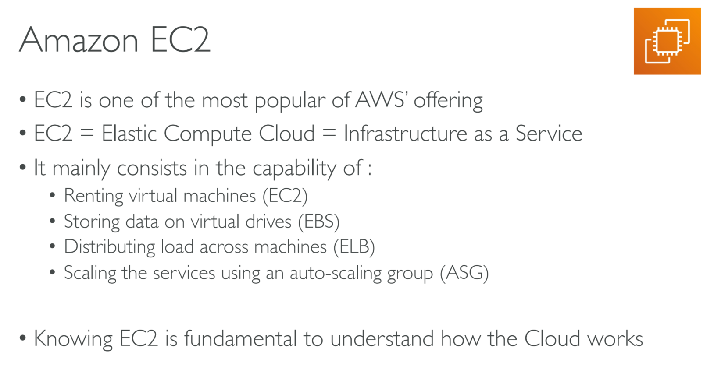
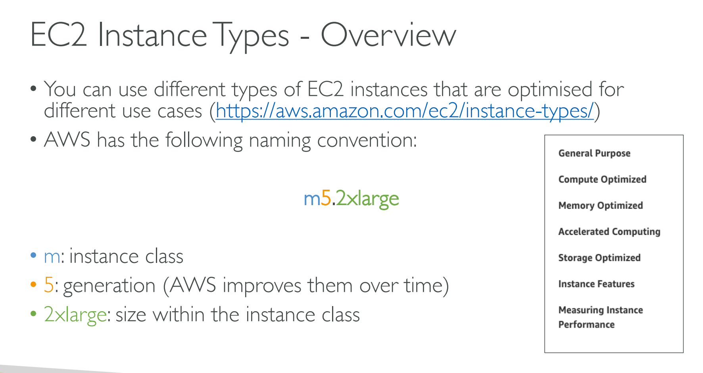
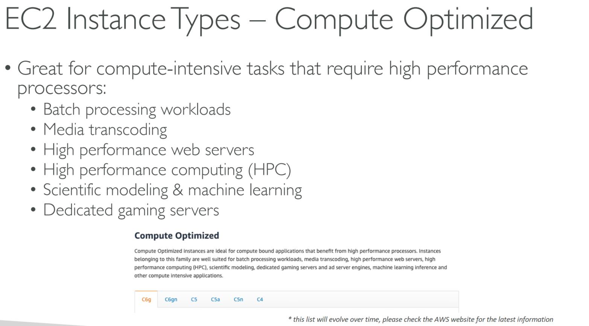
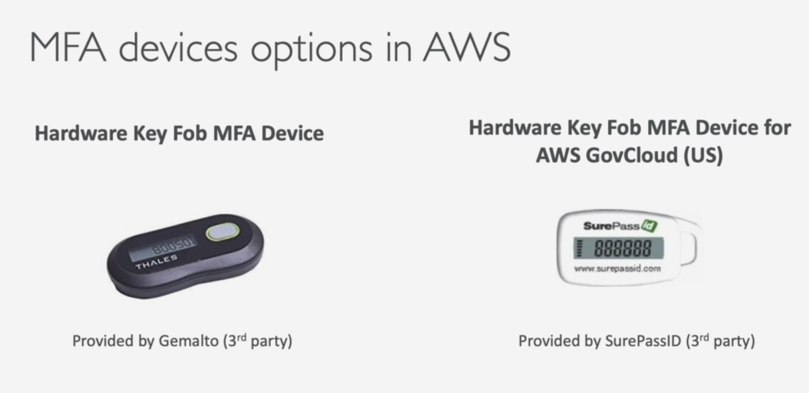
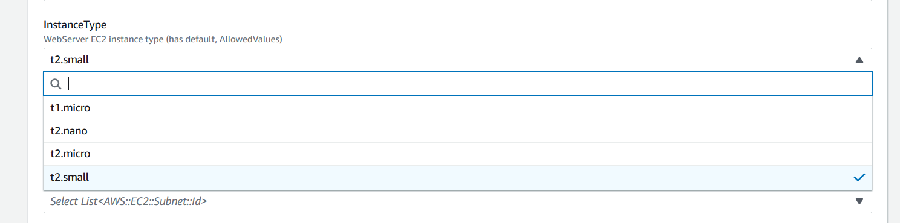

# EC2 Fundamentals

- [EC2 Fundamentals](#ec2-fundamentals)
  - [001 AWS Budget Setup](#001-aws-budget-setup)
    - [Amazon EC2](#amazon-ec2)
    - [EC2 sizing & configuration options](#ec2-sizing--configuration-options)
    - [EC2 User Data](#ec2-user-data)
  - [002 EC2 Basics](#002-ec2-basics)
    - [Hands-On:Launching an EC2 Instance running Linux](#hands-onlaunching-an-ec2-instance-running-linux)
  - [003 Create an EC2 Instance with EC2 User Data to have a Website Hands On](#003-create-an-ec2-instance-with-ec2-user-data-to-have-a-website-hands-on)
    - [create a demo video for this](#create-a-demo-video-for-this)
  - [004 EC2 Instance Types Basics](#004-ec2-instance-types-basics)
    - [Amazon EC2 Instance Types](#amazon-ec2-instance-types)
    - [EC2 Instance Types - General Purpose](#ec2-instance-types---general-purpose)
    - [EC2 Instance Types - Compute Optimized](#ec2-instance-types---compute-optimized)
    - [EC2 Instance Types - Memory Optimized](#ec2-instance-types---memory-optimized)
    - [EC2 Instance Types - Storage Optimized](#ec2-instance-types---storage-optimized)
    - [EC2 Instance Types - Example](#ec2-instance-types---example)
  - [005 Security Groups & Classic Ports Overview](#005-security-groups--classic-ports-overview)
    - [introduction to security groups](#introduction-to-security-groups)
    - [Security Group Deep Dive](#security-group-deep-dive)
    - [Security Group Diagram](#security-group-diagram)
    - [Security Groups Good to Know](#security-groups-good-to-know)
    - [Referencing other security groups](#referencing-other-security-groups)
    - [Classic ports to know](#classic-ports-to-know)
  - [006 Security Groups Hands On](#006-security-groups-hands-on)
  - [007 SSH Overview](#007-ssh-overview)
  - [008 How to SSH using Linux or Mac](#008-how-to-ssh-using-linux-or-mac)
  - [009 How to SSH using Windows](#009-how-to-ssh-using-windows)
  - [010 How to SSH using Windows 10](#010-how-to-ssh-using-windows-10)
  - [012 EC2 Instance Connect](#012-ec2-instance-connect)
  - [013 EC2 Instance Roles Demo](#013-ec2-instance-roles-demo)
  - [014 EC2 Instance Purchasing Options](#014-ec2-instance-purchasing-options)

## 001 AWS Budget Setup

[TODO demo video]()

### Amazon EC2

### EC2 sizing & configuration options

### EC2 User Data

## 002 EC2 Basics

### Hands-On:Launching an EC2 Instance running Linux

## 003 Create an EC2 Instance with EC2 User Data to have a Website Hands On

### [create a demo video for this]()

## 004 EC2 Instance Types Basics

### Amazon EC2 Instance Types

[details link](https://aws.amazon.com/ec2/instance-types/)

### EC2 Instance Types - General Purpose

### EC2 Instance Types - Compute Optimized

### EC2 Instance Types - Memory Optimized

### EC2 Instance Types - Storage Optimized

### EC2 Instance Types - Example

[ec2 comparison details](https://instances.vantage.sh/?region=ap-south-1)

## 005 Security Groups & Classic Ports Overview

### introduction to security groups

### Security Group Deep Dive

### Security Group Diagram

### Security Groups Good to Know

### Referencing other security groups

### Classic ports to know

<!-- -----------------------------------  ----------- -->

## 006 Security Groups Hands On

## 007 SSH Overview

## 008 How to SSH using Linux or Mac

## 009 How to SSH using Windows

## 010 How to SSH using Windows 10

## 012 EC2 Instance Connect

## 013 EC2 Instance Roles Demo

## 014 EC2 Instance Purchasing Options

