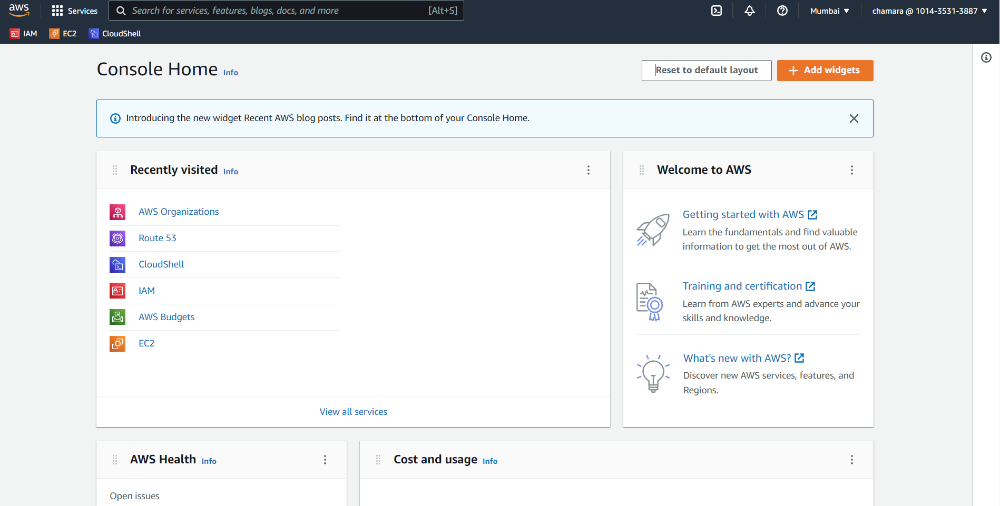
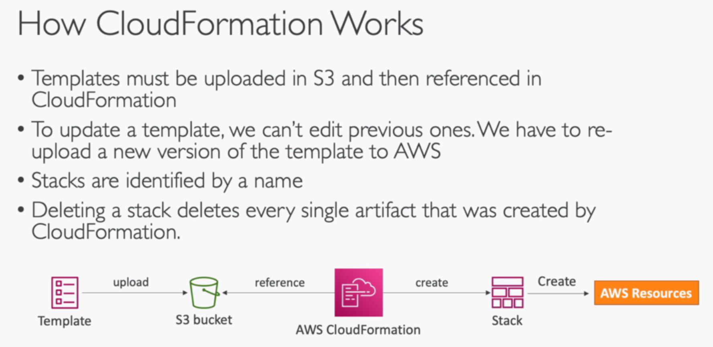
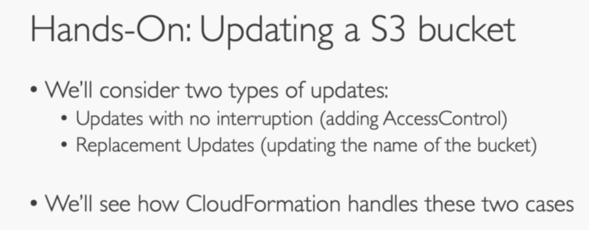
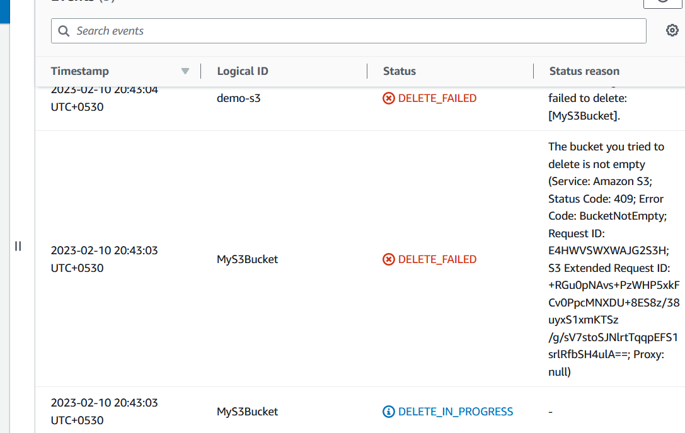
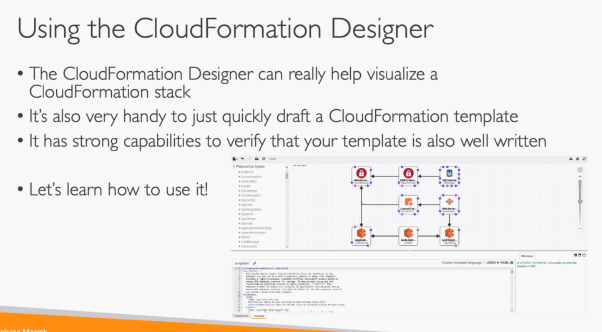
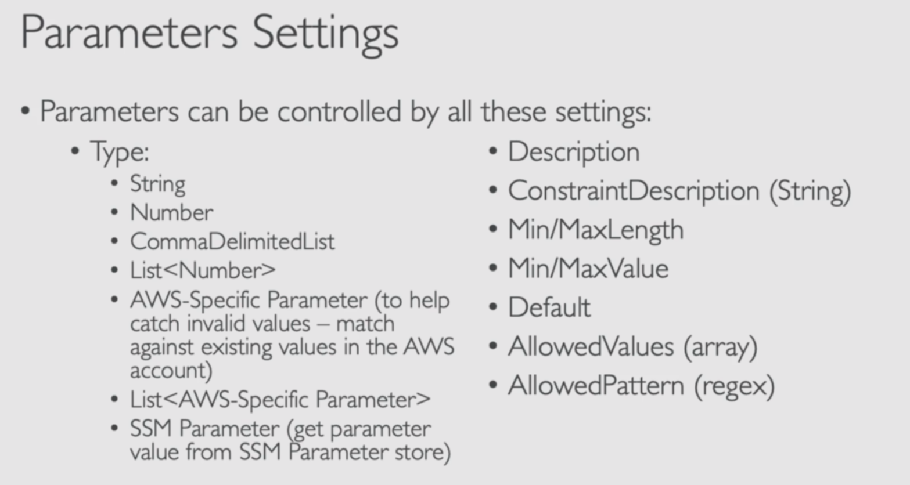
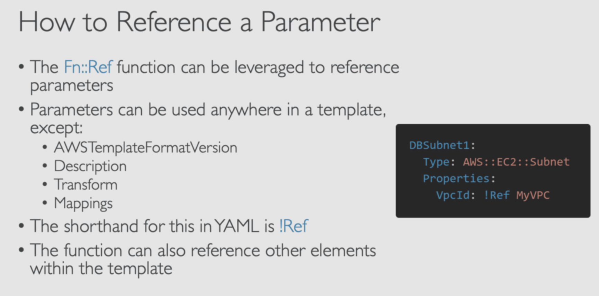
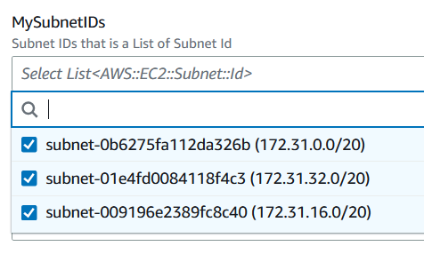

# EC2 Instance Storage

## 001 EBS Overview

## 002 EBS Hands On
let's create a another EBS volume in the same AZ as the EC2 instance

let's attach the EBS volume to the EC2 instance

we have to create the EBS in the same AZ as the EC2 instance because EBS is AZ specific.

let's create a EBS volume in a different AZ

and attach it to the EC2 instance

as you can see we can't attach the EBS volume to the EC2 instance because the EBS volume is in a different AZ.

let's delete the EBS volume in the different AZ

EBS we have created is not delete on termination by default. so we have to delete it manually.

let's terminate the EC2 instance

as you can see the EBS volume is still available.

## 003 EBS Snapshots

## 004 EBS Snapshots - Hands On

## 005 AMI Overview

## 006 AMI Hands On

## 007 EC2 Instance Store

## 008 EBS Volume Types

## 009 EBS Multi-Attach

## 010 Amazon EFS

## 011 Amazon EFS - Hands On

## 012 EFS vs EBS

## 013 EBS & EFS - Section Cleanup

<!-- -----------------------------------  ----------- -->

