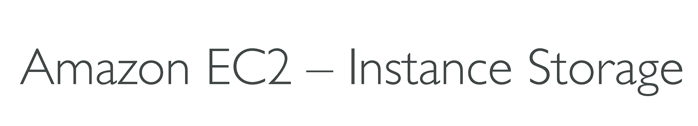
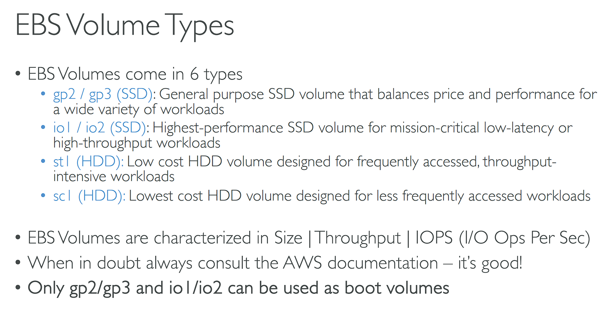
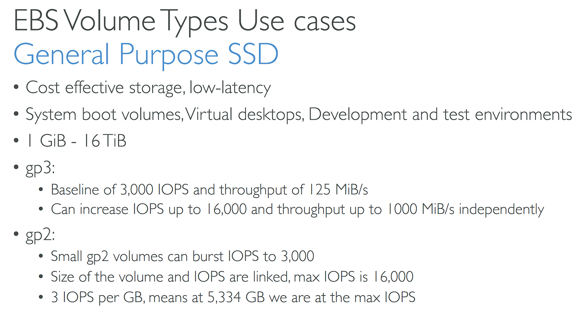
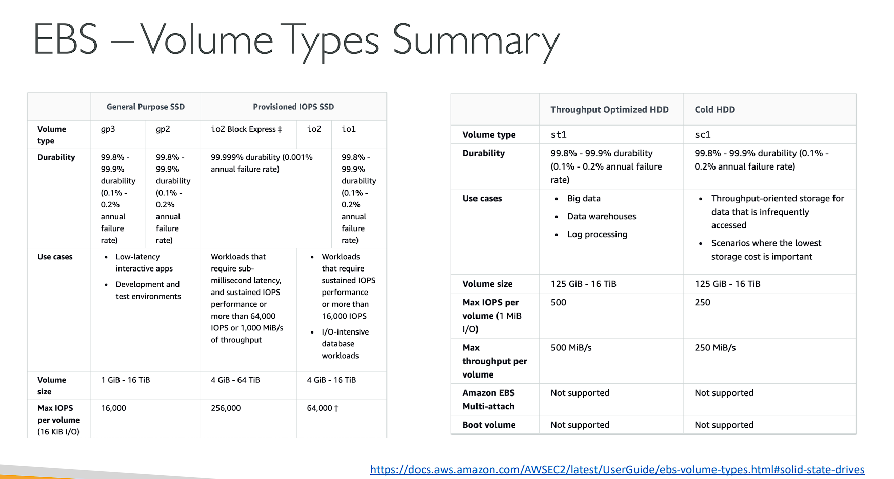
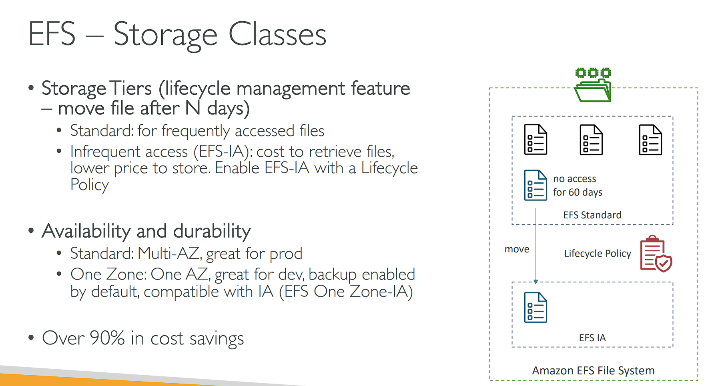

# EC2 Instance Storage ✅

## 001 EBS Overview ✅

## 002 EBS Hands On ✅
let's create a another EBS volume in the same AZ as the EC2 instance

let's attach the EBS volume to the EC2 instance

we have to create the EBS in the same AZ as the EC2 instance because EBS is AZ specific.

let's create a EBS volume in a different AZ

and attach it to the EC2 instance

as you can see we can't attach the EBS volume to the EC2 instance because the EBS volume is in a different AZ.

let's delete the EBS volume in the different AZ

EBS we have created is not delete on termination by default. so we have to delete it manually.

let's terminate the EC2 instance

as you can see the EBS volume is still available.

## 003 EBS Snapshots

## 004 EBS Snapshots - Hands On ✅

let's create a copy of the snapshot

when we are creating a copy of the snapshot we can create in any 
AZ.
this can be useful if you have a disaster recovery plan.

what we can do from a snapshot?

we can recreate a EBS volume from a snapshot.

Recycle Bin for EBS Snapshots

we can create a retention rule for the snapshot.

we can Archive the snapshots.

let's delete the snapshots

let's go to the recycle bin

now we can recover the deleted snapshots.

now we can see the deleted snapshots.

## 005 AMI Overview ✅

## 006 AMI Hands On ✅
let's create a AMI from the EC2 instance.

first create a ec2 instance

let's create a EC2 from the custom AMI

## 007 EC2 Instance Store ✅

## 008 EBS Volume Types ✅

### General Purpose SSD (gp2) ✅

### Provisioned IOPS SSD (io1) ✅

### Throughput Optimized HDD (st1)/Cold HDD (sc1) ✅

## 009 EBS Multi-Attach ✅

## 010 Amazon EFS ✅

## 011 Amazon EFS - Hands On ❌

## 012 EFS vs EBS

