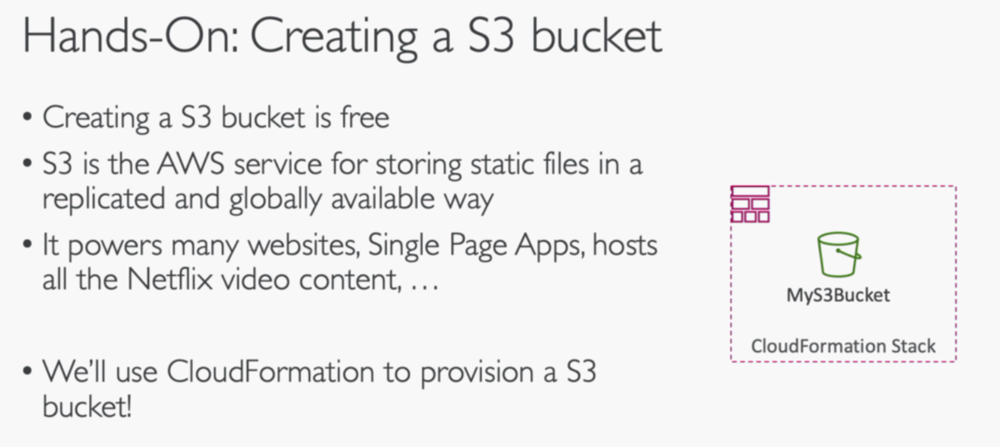
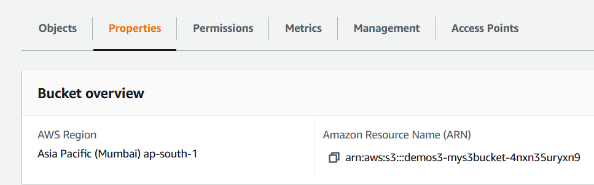
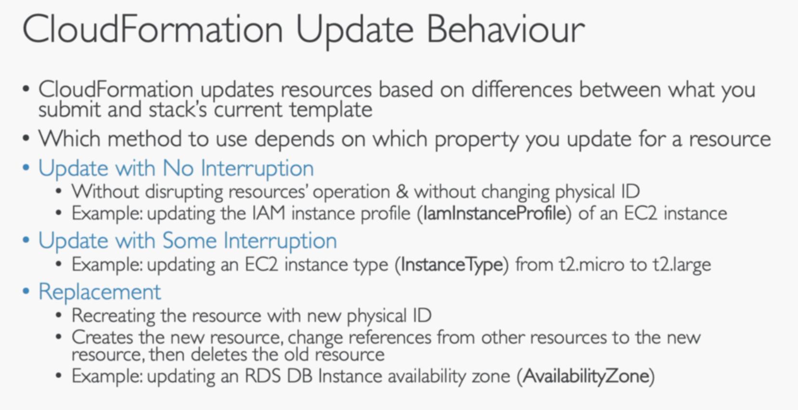
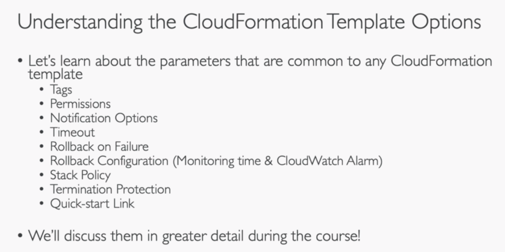

# Getting Started

## 1. YAML Tutorial


exercise o1
```json
{
  "course": "AWS Lambda",
  "instructor": "Stephane Maarek",
  "instructor-full": {
    "first-name": "Stephane",
    "last-name": "Maarek",
    "awesomeness-level": 9000
  },
  "sections-list": [
    "Introduction",
    "Deploying your first function",
    "Learning AWS Lambda in depth",
    "Real world examples"
  ],
  "lectures": [
    {
      "lecture-id": 1,
      "lecture-name": "intro",
      "lecture-length": "5:03"
    },
    {
      "lecture-id": 2,
      "lecture-name": "aws lambda",
      "lecture-length": "10:47"
    }
  ]
}

```

convert this to YAML

```YAML
course: AWS Lambda
  instructor: Stephane Maarek
  instructor-full:
    first-name: Stephane
    last-name: Maarek
    awesomeness-level: 9000
  sections-list:
  - Introduction: |
    Deploying your first function
    Learning AWS Lambda in depth
    Real world examples
  lectures:
      lecture-id: 1
      lecture-name: intro
      lecture-length: 5:03
    {
      lecture-id: 2
      lecture-name: aws lambda
      lecture-length: 10:47
    }
```

## 2. Creating an S3 Bucket using CloudFormation

```YAML
Resources:
  MyS3Bucket:
    Type: AWS::S3::Bucket
    Properties: {}

```

this will create a s3 Bucket in the region we are opening our CloudFormation 



## 3. Updating an S3 Bucket using CloudFormation




```YAML
```
```YAML
```
```YAML
```
## 4. Deleting an S3 Bucket using CloudFormation
## 5. CloudFormation Template Options
## 6. Using CloudFormation Designer
## 7. CloudFormation Building Blocks
## 8. Deploying CloudFormation Templates
## 9. Cost estimate for your templates




