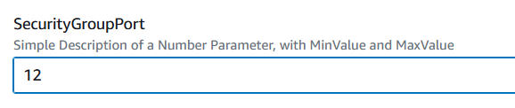
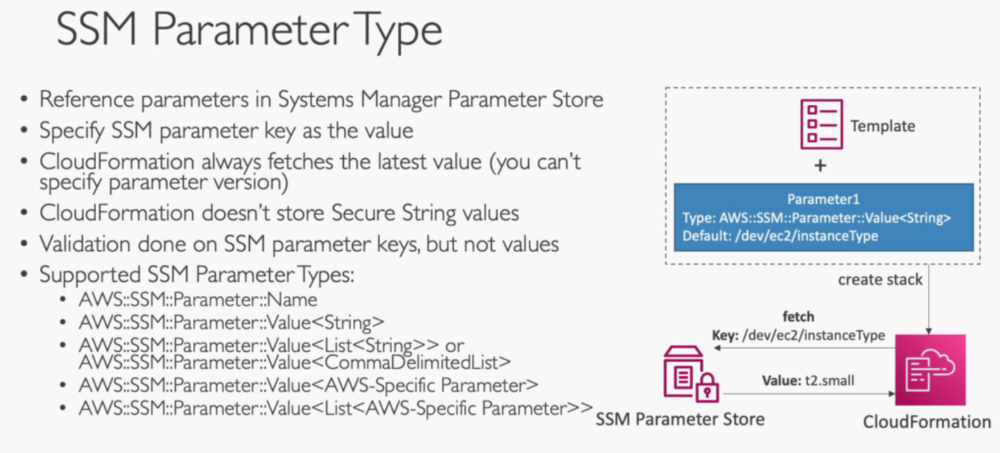
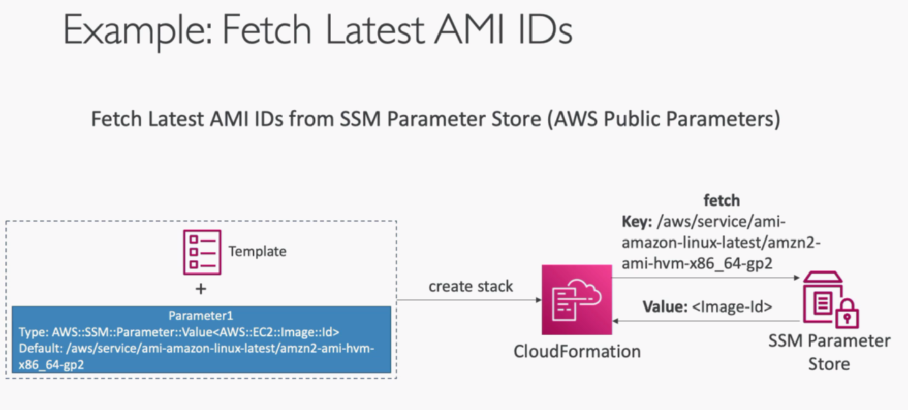
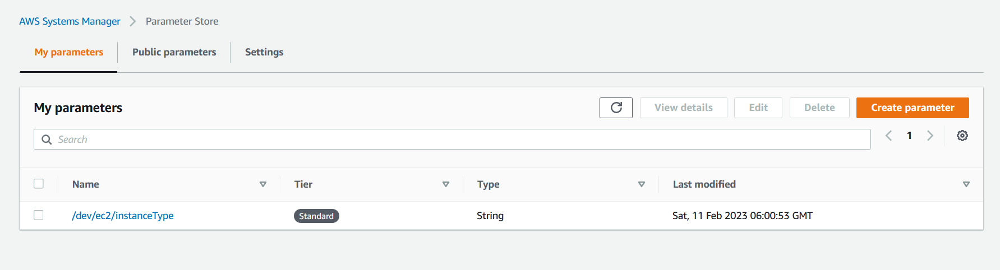
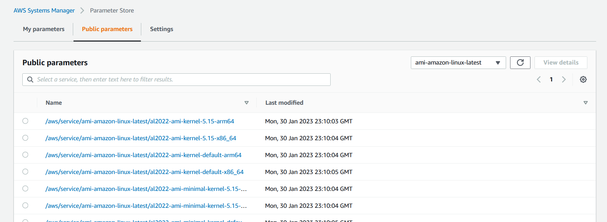
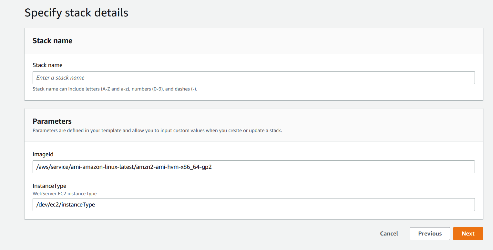

# CloudFormation Parameters
- 1. Parameters Theory


- 2. Parameters Hands-On

InstanceType

KeyName

DBPwd

DbSubnetIpBlocks


MySubnetIDs


MyVPC


SecurityGroupDescription


SecurityGroupDescription


SecurityGroupPort


```YAML
Parameters:
# most simple parameter
  SecurityGroupDescription:
    Description: Security Group Description (Simple parameter)
    Type: String
# here we have added constraints
  SecurityGroupPort:
    Description: Simple Description of a Number Parameter, with MinValue and MaxValue
    Type: Number
    MinValue: 1150
    MaxValue: 65535

  InstanceType:
    Description: WebServer EC2 instance type (has default, AllowedValues)
    Type: String
    Default: t2.small
    # this will show in the drop down
    AllowedValues:
      - t1.micro
      - t2.nano
      - t2.micro
      - t2.small
    ConstraintDescription: must be a valid EC2 instance type.

  DBPwd:
#   this will hide the user input and hide the values in logs 
    NoEcho: true
    Description: The database admin account password (won't be echoed)
    Type: String

  KeyName:
    Description: Name of an existing EC2 KeyPair to enable SSH access to the instances. Linked to AWS Parameter
    # this will show the available keys in your account
    Type: AWS::EC2::KeyPair::KeyName
    ConstraintDescription: must be the name of an existing EC2 KeyPair.

  SecurityGroupIngressCIDR:
    Description: The IP address range that can be used to communicate to the EC2 instances
    Type: String
    MinLength: '9'
    MaxLength: '18'
    Default: 0.0.0.0/0
    AllowedPattern: (\d{1,3})\.(\d{1,3})\.(\d{1,3})\.(\d{1,3})/(\d{1,2})
    ConstraintDescription: must be a valid IP CIDR range of the form x.x.x.x/x.

  MyVPC:
    Description: VPC to operate in
    Type: AWS::EC2::VPC::Id

  MySubnetIDs:
    Description: Subnet IDs that is a List of Subnet Id
    Type: "List<AWS::EC2::Subnet::Id>"

  DbSubnetIpBlocks:
    Description: "Comma-delimited list of three CIDR blocks"
    Type: CommaDelimitedList
    Default: "10.0.48.0/24, 10.0.112.0/24, 10.0.176.0/24"

Resources:
  MyEC2Instance:
    Type: AWS::EC2::Instance
    Properties:
      #we reference the InstanceType parameter
      InstanceType: !Ref InstanceType
    #   key name from ec2 instance key value pair
      KeyName: !Ref KeyName
    #   amazon machine id used to build this resources
      ImageId: ami-0742b4e673072066f
      # here we reference an internal CloudFormation resource
      SubnetId: !Ref DbSubnet1

  MySecurityGroup:
    Type: AWS::EC2::SecurityGroup
    Properties:
    # using the parameters
      GroupDescription: !Ref SecurityGroupDescription
      SecurityGroupIngress:
    # using the parameters
        - CidrIp: !Ref SecurityGroupIngressCIDR
    # using the parameters
          FromPort: !Ref SecurityGroupPort
    # using the parameters        
          ToPort: !Ref SecurityGroupPort
          IpProtocol: tcp
    # using the parameters
      VpcId: !Ref MyVPC

  DbSubnet1:
#   this will allow the available values to show in the dropdown.
    Type: AWS::EC2::Subnet
    Properties:
    # using the parameters
      VpcId: !Ref MyVPC
      # the select function allows us to select across a list !Select [index, list ]
      CidrBlock: !Select [0, !Ref DbSubnetIpBlocks]

  DbSubnet2:
    Type: AWS::EC2::Subnet
    Properties:
      VpcId: !Ref MyVPC
      # the select function allows us to select across a list
      CidrBlock: !Select [1, !Ref DbSubnetIpBlocks]
      
  DbSubnet3:
    Type: AWS::EC2::Subnet
    Properties:
      VpcId: !Ref MyVPC
      # the select function allows us to select across a list
      CidrBlock: !Select [2, !Ref DbSubnetIpBlocks]

```
- 3. ADVANCED - SSM Parameter Type




- 4. ADVANCED - SSM Parameter Type Hands On
```yaml
Parameters:
  InstanceType:
    Description: WebServer EC2 instance type
    Type: AWS::SSM::Parameter::Value<String>
    # this is added by us
    Default: /dev/ec2/instanceType
    
  ImageId:
    Type: AWS::SSM::Parameter::Value<AWS::EC2::Image::Id>
    # this is aws managed
    Default: /aws/service/ami-amazon-linux-latest/amzn2-ami-hvm-x86_64-gp2

Resources:
  MyEC2Instance:
    Type: AWS::EC2::Instance
    Properties:
      InstanceType: !Ref InstanceType
      ImageId: !Ref ImageId

```
adding private parameter


using public parameter


values will be like this


we can update the params and update the stack as well


